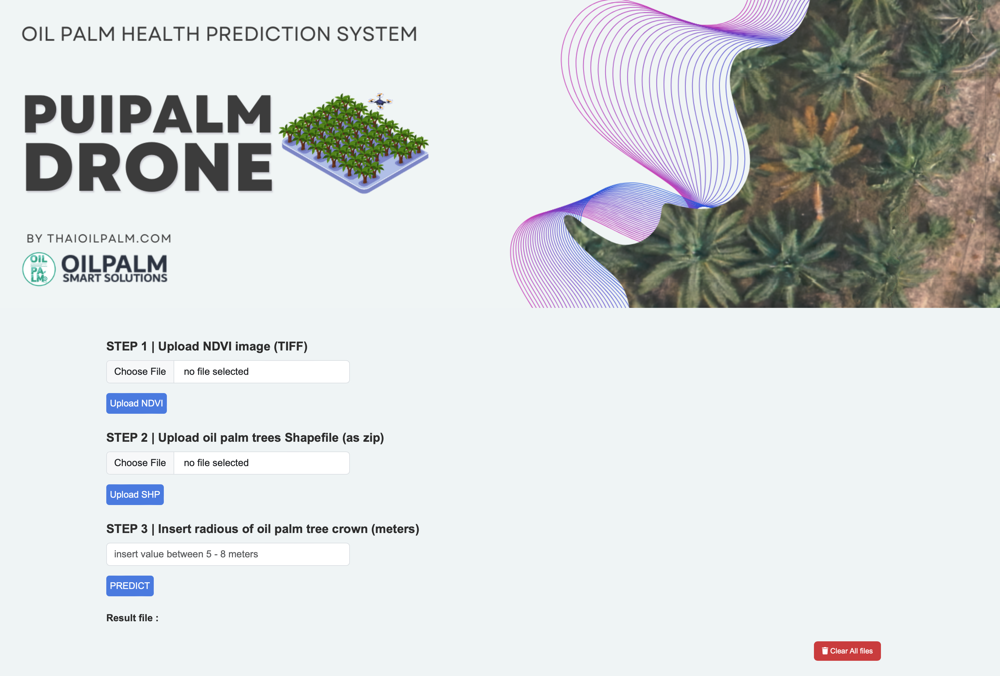

# Pui Palm Drone



This project is a web app that takes `NDVI image (TIFF)` and `oil palm trees Shapefile` to predict the health of the Oil Palm tree.

- [Pui Palm Drone](#pui-palm-drone)
  - [How to deploy](#how-to-deploy)
    - [1. Load model](#1-load-model)
    - [2. Deploy](#2-deploy)
      - [2.1 Deploy with `Traefik`](#21-deploy-with-traefik)
      - [2.2 Deploy without `Traefik`](#22-deploy-without-traefik)
    - [3. Session?](#3-session)


## How to deploy

### 1. Load model

The `RandomForestClassifier` model has to be provided by you.
Once you obtain the model, the model has to be placed in the folder `/project/form/processing/model/RandomForestClassifier`.

### 2. Deploy

The project is originally developed using `docker compose` with `Traefik` as a reverse proxy.
If you don't want to use `Traefik`, please refer to [2.2 Deploy without `Traefik`](#deploy-without-traefik)

#### 2.1 Deploy with `Traefik`

Once you set the `Traefik` up, you can run

```sh
docker compose up -d --build
```

This will build and run using `docker-compose.yaml`.

```yaml
version: '3.9'
services:
  web:
    command: pipenv run python manage.py runserver 0.0.0.0:80
    image: donut-web:latest
    build:
      context: .
      dockerfile: .Dockerfile
    platform: linux/amd64
    labels:
      # Allow Traefik to talk with your service
      - traefik.enable=true
      # Tell Traefik to use port 80
      - traefik.http.services.web-donut.loadbalancer.server.port=80
      # This config you domain name. By default, your subdomain is web-donut
      # If you which to change the subdomain name, you uncomment the below configuration
      - traefik.http.routers.web-donut.rule=Host(`donut.localhost`)
      # Below is for enable SSL.
      - traefik.http.routers.web-donut.tls=true
      - traefik.http.routers.web-donut.tls.certresolver=production
      - traefik.http.routers.web-donut.entrypoints=websecure
    # This define network. You would need to keep it like this.
    networks:
      - default
      - traefik_default

# Keep it like this too.
networks:
  default:
  traefik_default:
    external: true
```

#### 2.2 Deploy without `Traefik`

To deploy with `Traefik`, you can simply just remove `services.web.labels`, `services.web.networks`, and `networks` sections in the `docker-compose.yaml`.
Then, to access the web, you will have to forward the port.
Because `pipenv run python manage.py runserver 0.0.0.0:80` will run `Django` server at port 80 in the container, we will forward the port of the Host to 80 of the container.
This is done via the section `services.web.ports`.
In the example below (or in `docker-compose-noTraefik.yaml`), we forward the port 8080 of Host to port 80 of container (host_port:container_port) (8080:80).

```yaml
version: '3.9'
services:
  web:
    # This is the command to run
    command: pipenv run python manage.py runserver 0.0.0.0:80
    # The image name
    image: donut-web:v0.0.1
    # How to build
    build:
      context: .
      dockerfile: .Dockerfile
    # compatible with x86_64 architecture
    platform: linux/amd64
    # forward the port (host_port:container_port)
    ports:
      - 8080:80
```

### 3. Session?

The entire app logic is found in `/project/form/views.py`.
We, first, set the `seesionid` into `COOKIE`.

```python
def _session(request) -> str:
    if('sessionid' not in request.COOKIES.keys()):
        print("Empty session. Create new one.")
        request.session.cycle_key()
    return request.session.session_key
```

Then, all the files that the user upload will be stored in the path `/root/storage/<sessionid>`

```python
def _get_storage_path(request) -> str:
    return os.path.join("/root","storage",request.session.session_key)
```

Because of how the Docker works, if the container is deleted, all sessions and files are deleted along with the container.
If you want to persist the sessions, you will have to map a volume to `/root/storage`.
You can do this by adding `services.web.volumes` section like this

```yaml
version: '3.9'
services:
  web:
    # This is the command to run
    command: pipenv run python manage.py runserver 0.0.0.0:80
    # The image name
    image: donut-web:v0.0.1
    # How to build
    build:
      context: .
      dockerfile: .Dockerfile
    # compatible with x86_64 architecture
    platform: linux/amd64
    # forward the port (host_port:container_port)
    ports:
      - 8080:80
    volumes:
      - storage:/root/storage

volumes:
  storage:
```

Keep in mind that we don't have cache expiration implemented in the project.
Thus, all files will never be deleted by the system.
